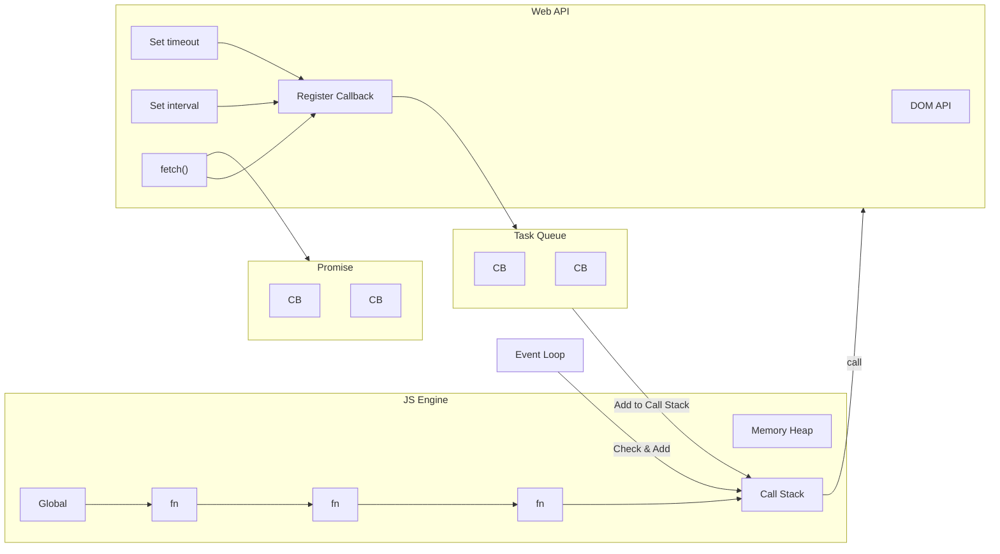

```mermaid
flowchart LR
    subgraph JS_Engine["JS Engine"]
        Memory_Heap["Memory Heap"]
        Call_Stack["Call Stack"]
        fn1["fn"] --> Call_Stack
        fn2["fn"] --> fn1
        fn3["fn"] --> fn2
        Global_Context["Global"] --> fn3
    end
    
    subgraph Web_API["Web API"]
        DOM_API["DOM API"]
        SetTimeout["Set timeout"]
        SetInterval["Set interval"]
        Fetch["fetch()"] --> Register_Callback["Register Callback"]
    end
    
    subgraph Promises["Promise"]
        CB1["CB"]
        CB2["CB"]
    end
    
    subgraph Task_Queue["Task Queue"]
        CB3["CB"]
        CB4["CB"]
    end
    
    Event_Loop["Event Loop"]

    Call_Stack -->|call| Web_API
    SetTimeout --> Register_Callback
    SetInterval --> Register_Callback
    Fetch --> Promises
    Register_Callback --> Task_Queue
    Task_Queue -->|Add to Call Stack| Call_Stack
    Event_Loop -->|Check & Add| Call_Stack
```